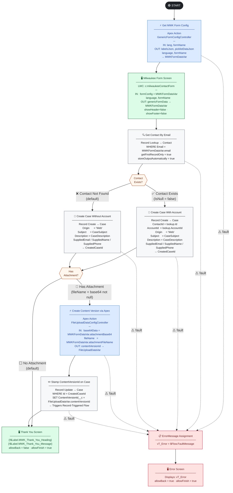
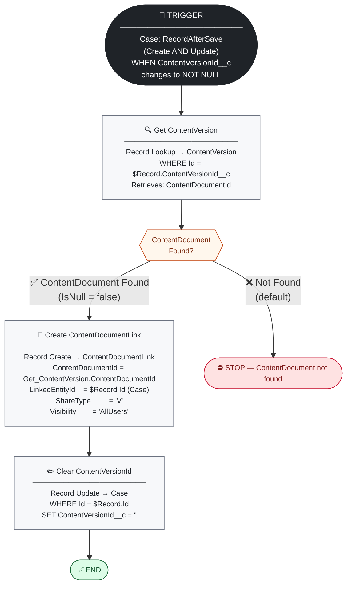
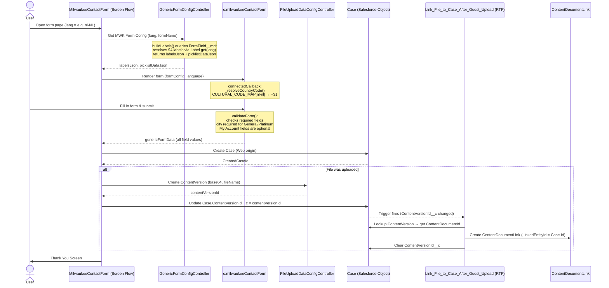

# MilwaukeeContactForm — Complete Technical Reference

**Flow API Name:** `MilwaukeeContactForm`  
**LWC Component:** `c:milwaukeeContactForm`  
**Form Name Key:** `MWK_Contact`  
**Process Type:** Screen Flow  
**Run Mode:** `SystemModeWithoutSharing`  
**API Version:** 67.0  
**Package Version:** 67.0

> **Last updated:** reflects all changes applied in the current development session — error message translations, city/field validation rules, My Account optional fields, `CULTURAL_CODE_MAP` phone resolution, 18 new `FormField__mdt` error-label records, 98 Custom Labels, 32 translation files, 2 new `FormField__mdt` UI-text records (`MWK_Please_Select`, `MWK_Search_Placeholder`), and 2 Thank You screen labels (`MWK_Thank_You_Heading`, `MWK_Thank_You_Message`) replacing the hardcoded Flow `DisplayText` with translated, styled rich-text.

---

## Table of Contents

1. [Deployment Manifest Overview](#1-deployment-manifest-overview)
2. [Apex Classes](#2-apex-classes)
3. [Lightning Web Components](#3-lightning-web-components)
4. [Flows](#4-flows)
5. [Custom Metadata Objects & Fields](#5-custom-metadata-objects--fields)
6. [Custom Metadata Records — FormField__mdt (MWK)](#6-custom-metadata-records--formfield__mdt-mwk)
7. [Custom Metadata Records — FormFieldOption__mdt (MWK)](#7-custom-metadata-records--formfieldoption__mdt-mwk)
8. [Custom Metadata Records — FormField__mdt (RYO)](#8-custom-metadata-records--formfield__mdt-ryo)
9. [Custom Metadata Records — FormFieldOption__mdt (RYO)](#9-custom-metadata-records--formfieldoption__mdt-ryo)
10. [Custom Labels — All 98 MWK Labels](#10-custom-labels--all-98-mwk-labels)
11. [Layouts](#11-layouts)
12. [Translations](#12-translations)
13. [Form Validation Rules](#13-form-validation-rules)
14. [Phone Country Code Resolution](#14-phone-country-code-resolution)
15. [Primary Flow Diagram — MilwaukeeContactForm](#15-primary-flow-diagram--milwaukeecontactform)
16. [Supporting Flow Diagram — Link File to Case After Guest Upload](#16-supporting-flow-diagram--link-file-to-case-after-guest-upload)
17. [Flow Variables](#17-flow-variables)
18. [Text Templates](#18-text-templates)
19. [Flow Element Summary — MilwaukeeContactForm](#19-flow-element-summary--milwaukeecontactform)
20. [Flow Element Summary — Link File to Case After Guest Upload](#20-flow-element-summary--link-file-to-case-after-guest-upload)
21. [End-to-End Sequence Diagram](#21-end-to-end-sequence-diagram)

---

## 1. Deployment Manifest Overview

Source: `manifest/package.xml` — API version **67.0**

| Metadata Type | MWK Members | RYO/Shared Members | Total |
|---|---|---|---|
| `ApexClass` | 4 (incl. test classes) | 4 (incl. test classes) | 8 |
| `CustomLabel` | 98 | 0 | 98 |
| `CustomField` | `Case.ContentVersionId__c` (1) | — | 1 |
| `CustomMetadata` — `FormField` | 42 (21 field + 1 LBL_Phone + 18 ERR + 2 UI-text) | 18 | 60 |
| `CustomMetadata` — `FormFieldOption` | 49 (MWK) | 52 (RYO) | 101 |
| `CustomObject` | 2 (shared) | — | 2 |
| `Flow` | 2 MWK (`MilwaukeeContactForm` + `Link_File_to_Case_After_Guest_Upload`) | 1 (`GenericDynamicForm`) | 3 |
| `LightningComponentBundle` | 1 | 1 | 2 |
| `Layout` | 2 (shared) | — | 2 |
| `Translations` | 32 locales | — | 32 |

> **Deploy order:** `CustomField` → `CustomLabel` → `CustomMetadata` → `Flow` → `Translations`. The `Case.ContentVersionId__c` field must exist before the flows that reference it can be deployed.

---

## 2. Apex Classes

All 8 classes are deployed together. The 4 MWK-specific classes share the same `GenericFormConfig` DTO pattern used by both Milwaukee and Ryobi forms.

| Class | Type | Purpose |
|---|---|---|
| `GenericFormConfig` | Production | Apex-defined type (Flow variable). Dual role: config carrier (`labelsJson`, `picklistDataJson`) and form data output (`firstName`, `email`, etc.). All fields `@AuraEnabled @InvocableVariable`. |
| `GenericFormConfigController` | Production | `@InvocableMethod` called from Flow before the screen. Queries `FormField__mdt` + `FormFieldOption__mdt`, resolves translated labels via `Label.get()`, returns JSON strings. Label: *Get Generic Form Config*. |
| `GenericFormConfigControllerTest` | Test | 100% coverage for `GenericFormConfigController`. 11 test methods covering happy path, defaults, fault injection flags (`throwInOuterTry`, `forceElseLabel`), batch invocation. |
| `GenericFormConfigTest` | Test | Coverage for `GenericFormConfig` DTO. |
| `FileUploadDataConfig` | Production | Apex-defined wrapper for file upload Flow variable. Input: `fileName`, `base64Data`, `linkedEntityId`. Output: `contentVersionId`, `contentDocumentId`, `success`, `errorMessage`. |
| `FileUploadDataConfigController` | Production | `@InvocableMethod` (`without sharing`) — inserts `ContentVersion` from Base64. Guest-safe: no Case DML, no ContentDocument queries. Label: *Create Content Version (Generic)*. |
| `FileUploadDataConfigControllerTest` | Test | Coverage for `FileUploadDataConfigController`. |
| `FileUploadDataConfigTest` | Test | Coverage for `FileUploadDataConfig` DTO. |

### `GenericFormConfigController` — label resolution flow

```
buildLabels(lang, formName)
  └── SELECT DeveloperName, Custom_Label_API_Name__c, Placeholder__c
        FROM FormField__mdt WHERE Form_Name__c = :formName
  └── for each field:
        if Custom_Label_API_Name__c is set:
          Label.translationExists(ns, apiName, lang) → Label.get(ns, apiName, lang)
          else → Label.get(ns, apiName)          ← default org language
        else → MasterLabel (English fallback)
        labelsMap.put(DeveloperName, labelValue)
        if Placeholder__c is set → resolve same way, put(Placeholder__c, phValue)
```

> This is why every translated label needs a `FormField__mdt` record — without one, `buildLabels()` never calls `Label.get()` for that key, so it never appears in `labelsJson`, and the LWC always falls back to its hardcoded English default.

---

## 3. Lightning Web Components

| Component | Target | `isExposed` | Description |
|---|---|---|---|
| `milwaukeeContactForm` | `lightning__FlowScreen` | `true` | Milwaukee Tool UK contact form. Renders adaptive picklist cascade (L1–L4), conditional form body, phone country dropdown, file upload, validation, privacy disclaimer. Fires `FlowAttributeChangeEvent` + `FlowNavigationNextEvent`. API 67.0. |
| `genericDynamicForm` | `lightning__FlowScreen` | `true` | Generic form component shared by Ryobi and other brands. Driven by `formConfig` JSON from Apex. API 67.0. |

### `milwaukeeContactForm` — `@api` Properties

| Property | Type | Default | Direction | Description |
|---|---|---|---|---|
| `genericFormData` | `apex://GenericFormConfig` | — | `outputOnly` | All user-entered field values. Initialised in `connectedCallback`, updated via `FlowAttributeChangeEvent` on every interaction. |
| `formConfig` | `apex://GenericFormConfig` | — | Input | Set by the Flow before screen renders. Carries `labelsJson` + `picklistDataJson`. Setter busts the lazy-parse cache. |
| `language` | String | `en` | Input | BCP 47 locale string (e.g. `nl-NL`, `fr-BE`). Used to auto-select default phone country code via `CULTURAL_CODE_MAP`. |
| `formName` | String | `MWK_Contact` | Input | Must match `FormField__mdt.Form_Name__c`. |
| `defaultPhoneCountryCode` | String | `+44` | Input | Fallback dial code when no language match is found. |

### `milwaukeeContactForm` — Key Internal Getters

| Getter | Returns | Notes |
|---|---|---|
| `_resolvedLabels` | `Object` | Lazy-parses `formConfig.labelsJson` once; cached in `_labels`. |
| `_resolvedPicklistData` | `Object` | Lazy-parses `formConfig.picklistDataJson` once; cached in `_picklistData`. |
| `showFormBody` | `Boolean` | `true` once a valid L3 enquiry is selected (and L4 if My Account path requires it). |
| `showCompanyName` | `Boolean` | ODQT, GeneralEnquiry, SQT_Where_to_Buy, SQT_Other paths. |
| `showCity` | `Boolean` | ODQT, GeneralEnquiry, ServiceTech, OrderStatus, OneKey, and several SQT paths. |
| `isCityRequired` | `Boolean` | `true` for `MWK_YEA_Cust_Uses_General` **and** `MWK_YEA_Cust_Uses_Platinum`. |
| `_isMyAccount` | `Boolean` | `true` for `MWK_YEA_Cust_Uses_MyAccount`. When true, Company Name, Job Title, Number of Employees, and Trade are **optional** (shown but not validated). |
| `errorSummaryItems` | `Array` | Ordered list of `{ key, message }` for the top-of-form error summary. Order: describeYourself → customerType → enquiryAbout → moreDetails → firstName → lastName → email → confirmEmail → phone → message → companyName → **city** → jobTitle → numberOfEmployees → trade → dealerCustomerNo. |
| `_resolveCountryCode()` | `String` | Two-tier: exact `CULTURAL_CODE_MAP[locale]` match → language-prefix match in `PHONE_COUNTRY_CODES` → `defaultPhoneCountryCode`. |

---

## 4. Flows

| API Name | Type | Run Mode | Status | Description |
|---|---|---|---|---|
| `MilwaukeeContactForm` | Screen Flow | `SystemModeWithoutSharing` | Draft | Primary Milwaukee contact form journey. Config → Screen → Contact lookup → Case create → optional file upload → Thank You. Fault connectors on all Apex/DML elements. |
| `GenericDynamicForm` | Screen Flow | `SystemModeWithoutSharing` | Active | Shared Ryobi/generic form flow. Same Apex action pattern, no fault connector on config action. |
| `Link_File_to_Case_After_Guest_Upload` | AutoLaunchedFlow — RecordAfterSave | `SystemModeWithoutSharing` | Active | Triggered when `Case.ContentVersionId__c` changes to NOT NULL. Looks up the `ContentVersion`, creates a `ContentDocumentLink` linking the file to the Case, then clears the staging field. See §16 for full element diagram. |

---

## 5. Custom Metadata Objects & Fields

### `FormField__mdt`

**Label:** Form Field | **Plural:** Form Fields | **Visibility:** Public  
**Description:** Generic form field definitions for multiple forms with multilingual support

| Field API Name | Label | Type | Length / Options | Description |
|---|---|---|---|---|
| `MasterLabel` _(system)_ | Master Label | Text | 40 | English fallback label; used when `Custom_Label_API_Name__c` is blank |
| `DeveloperName` _(system)_ | Developer Name | Text | 40 | Key used in `labelsJson` map by Apex; must match the key the LWC reads from `_resolvedLabels` |
| `Custom_Label_API_Name__c` | Custom Label API Name | Text | 255 | API name of the Custom Label for this field. Used by `buildLabels()` to call `Label.get()`. |
| `Field_Type__c` | Field Type | Picklist (restricted) | Text _(default)_, Email, Phone, Date, Text Area, Picklist, Checkbox | Rendering type hint. |
| `Form_Name__c` | Form Name | Text | 255 | Groups fields by form (`MWK_Contact`, `RYO_Contact`). SOQL filter key in both `buildLabels()` and `buildPicklists()`. |
| `Language__c` | Language | Text | 255 | Language code of this record (e.g. `en`). `buildPicklists()` filters to `Language__c = 'en'`. |
| `Placeholder__c` | Placeholder | Text | 255 | API name of the Custom Label for placeholder text. Resolved separately and added to `labelsJson` under the placeholder key. |

**Layouts:** `FormField__mdt-Form Field Layout`

---

### `FormFieldOption__mdt`

**Label:** Form Field Option | **Plural:** Form Field Options | **Visibility:** Public

| Field API Name | Label | Type | Description |
|---|---|---|---|
| `MasterLabel` _(system)_ | Master Label | Text(40) | English fallback label for the option |
| `DeveloperName` _(system)_ | Developer Name | Text(40) | Used as the `value` key in each picklist option map |
| `Custom_Label_API_Name__c` | Custom Label API Name | Text(255) | API name of the Custom Label for this option's display text |
| `Parent_Form_Field__c` | Parent Form Field | MetadataRelationship → `FormField__mdt` | Links this option to its parent field. Relationship name: `Form_Options`. |
| `Parent_Option_Value__c` | Parent Option Value | Text(255) | `DeveloperName` of the parent option this record depends on — enables cascading. Null for top-level options. Serialised as `parentValue`. |
| `Sort_Order__c` | Sort Order | Number(18,0) | Controls display order. Ordered by `Sort_Order__c ASC NULLS LAST`, then `MasterLabel ASC`. |

**Layouts:** `FormFieldOption__mdt-Form Field Option Layout`

---

## 6. Custom Metadata Records — FormField__mdt (MWK)

All records have `Form_Name__c = MWK_Contact`, `Language__c = en`.

### Field records

| Developer Name | Master Label | Field Type | Custom Label API Name | Placeholder Key |
|---|---|---|---|---|
| `MWK_Describe_Yourself` | MWK Describe Yourself | Picklist | `MWK_Describe_yourself` | `MWK_Describe_yourself` |
| `MWK_Customer_Type` | MWK Customer Type | Picklist | — | — |
| `MWK_Enquiry_About` | MWK Enquiry About | Picklist | — | — |
| `MWK_More_Details` | MWK More Details | Picklist | — | — |
| `MWK_First_Name` | MWK First Name | Text | — | — |
| `MWK_Last_Name` | MWK Last Name | Text | — | — |
| `MWK_Email_Address` | MWK Email Address | Email | — | — |
| `MWK_Confirm_Email` | MWK Confirm Email | Email | — | — |
| `MWK_Phone_Number` | MWK Phone Number | Phone | `MWK_Phone_Number` | `MWK_Phone_Number` |
| `MWK_LBL_Phone_Number` | MWK LBL Phone Number | Text | `MWK_LBL_Phone_Number` | — |
| `MWK_Company_Name` | MWK Company Name | Text | `MWK_Company_Name` | `MWK_Company_Name` |
| `MWK_Job_Title` | MWK Job Title | Picklist | — | — |
| `MWK_Number_of_Employees` | MWK Number of Employees | Picklist | — | — |
| `MWK_Trade` | MWK Trade | Picklist | — | — |
| `MWK_City` | MWK City | Text | `MWK_City` | `MWK_City` |
| `MWK_Business_Postcode` | MWK Business Postcode | Text | `MWK_Business_Postcode` | `MWK_Business_Postcode` |
| `MWK_Dealer_Customer_No` | MWK Dealer Customer No | Text | `MWK_Dealer_Customer_No` | `MWK_Dealer_Customer_No` |
| `MWK_Model_Name` | MWK Model Name | Text | `MWK_Model_Name` | `MWK_Model_Name` |
| `MWK_Order_Number` | MWK Order Number | Text | — | — |
| `MWK_Contact_Name` | MWK Contact Name | Text | — | — |
| `MWK_Message` | MWK Message | Text Area | `MWK_Message` | `MWK_Message` |
| `MWK_Upload_File` | MWK Upload File | Text | `MWK_Upload_File` | `MWK_Upload_File` |
| `MWK_Submit` | MWK Submit | Text | `MWK_Submit` | `MWK_Submit` |
| `MWK_Privacy_Disclaimer` | MWK Privacy Disclaimer | Text | — | — |
| `MWK_Privacy_Statement_Link` | MWK Privacy Statement Link | Text | — | — |
| `MWK_Search_Placeholder` | MWK Search Placeholder | Text | `MWK_Search_Placeholder` | `MWK_Search_Placeholder` |
| `MWK_Please_Select` | MWK Please Select | Text | `MWK_Please_Select` | `MWK_Please_Select` |

> **Why `MWK_Search_Placeholder` and `MWK_Please_Select` need `FormField__mdt` records:** `buildLabels()` only emits a label key into `labelsJson` for fields it finds in `FormField__mdt`. The Custom Labels and all 32 translation files already existed, but without these metadata records the keys were never written to `labelsJson`, so the LWC always fell back to its hardcoded English defaults ("Search..." / "Please select...") regardless of locale.

### Error label records (18 — added to enable translated error messages)

| Developer Name | Custom Label API Name |
|---|---|
| `MWK_ERR_Summary_Title` | `MWK_ERR_Summary_Title` |
| `MWK_ERR_Describe_Yourself` | `MWK_ERR_Describe_Yourself` |
| `MWK_ERR_Customer_Type` | `MWK_ERR_Customer_Type` |
| `MWK_ERR_Enquiry_About` | `MWK_ERR_Enquiry_About` |
| `MWK_ERR_More_Details` | `MWK_ERR_More_Details` |
| `MWK_ERR_First_Name` | `MWK_ERR_First_Name` |
| `MWK_ERR_Last_Name` | `MWK_ERR_Last_Name` |
| `MWK_ERR_Email` | `MWK_ERR_Email` |
| `MWK_ERR_Confirm_Email` | `MWK_ERR_Confirm_Email` |
| `MWK_ERR_Email_Mismatch` | `MWK_ERR_Email_Mismatch` |
| `MWK_ERR_Phone` | `MWK_ERR_Phone` |
| `MWK_ERR_Message` | `MWK_ERR_Message` |
| `MWK_ERR_Company_Name` | `MWK_ERR_Company_Name` |
| `MWK_ERR_Job_Title` | `MWK_ERR_Job_Title` |
| `MWK_ERR_Number_Of_Employees` | `MWK_ERR_Number_Of_Employees` |
| `MWK_ERR_Trade` | `MWK_ERR_Trade` |
| `MWK_ERR_Dealer_Customer_No` | `MWK_ERR_Dealer_Customer_No` |
| `MWK_ERR_City` | `MWK_ERR_City` |

> **Why these records exist:** `GenericFormConfigController.buildLabels()` only resolves labels for fields that have a `FormField__mdt` record with `Form_Name__c = 'MWK_Contact'`. Without these records, error keys were never included in `labelsJson`, and the LWC always fell back to hardcoded English strings regardless of the current locale.

---

## 7. Custom Metadata Records — FormFieldOption__mdt (MWK)

### L1 — Describe Yourself (`MWK_Describe_Yourself`)

| Developer Name | Custom Label Key | Parent Option Value | Sort |
|---|---|---|---|
| `MWK_DY_Sells_Tools` | `MWK_DY_company_sells_tools` | — | 1 |
| `MWK_DY_Uses_Milwaukee` | `MWK_DY_company_uses_Milwaukee` | — | 2 |
| `MWK_DY_I_Use_Milwaukee` | `MWK_DY_I_use_Milwaukee` | — | 3 |

### L2 — Customer Type (`MWK_Customer_Type`) — parent: Sells Tools

| Developer Name | Custom Label Key | Parent Option Value | Sort |
|---|---|---|---|
| `MWK_TC_New_Customer` | `MWK_TC_New_Prosp_Customer` | `MWK_DY_Sells_Tools` | 1 |
| `MWK_TC_Existing_Customer` | `MWK_TC_Existing_Customer` | `MWK_DY_Sells_Tools` | 2 |

### L3 — Enquiry About (`MWK_Enquiry_About`)

| Developer Name | Custom Label Key | Parent Option Value | Sort |
|---|---|---|---|
| `MWK_YEA_NewCust_General` | `MWK_YEA_General_Enquiry` | `MWK_TC_New_Customer` | 1 |
| `MWK_YEA_ExistCust_General` | `MWK_YEA_General_Enquiry` | `MWK_TC_Existing_Customer` | 1 |
| `MWK_YEA_ExistCust_Service` | `MWK_YEA_Service_Tech_Ques` | `MWK_TC_Existing_Customer` | 2 |
| `MWK_YEA_ExistCust_Order` | `MWK_YEA_Order_Status` | `MWK_TC_Existing_Customer` | 3 |
| `MWK_YEA_ExistCust_OneKey` | `MWK_YEA_ONE_KEY_Support` | `MWK_TC_Existing_Customer` | 4 |
| `MWK_YEA_Cust_Uses_General` | `MWK_YEA_General_Enquiry` | `MWK_DY_Uses_Milwaukee` | 1 |
| `MWK_YEA_Cust_Uses_Platinum` | `MWK_YEA_Platinum_Service` | `MWK_DY_Uses_Milwaukee` | 2 |
| `MWK_YEA_Cust_Uses_MyAccount` | `MWK_YEA_My_Account` | `MWK_DY_Uses_Milwaukee` | 3 |
| `MWK_YEA_IUse_General` | `MWK_YEA_General_Enquiry` | `MWK_DY_I_Use_Milwaukee` | 1 |
| `MWK_YEA_IUse_Service` | `MWK_YEA_Service_Tech_Ques` | `MWK_DY_I_Use_Milwaukee` | 2 |
| `MWK_YEA_IUse_MyAccount` | `MWK_YEA_My_Account` | `MWK_DY_I_Use_Milwaukee` | 3 |
| `MWK_YEA_IUse_OneKey` | `MWK_YEA_ONE_KEY_Support` | `MWK_DY_I_Use_Milwaukee` | 4 |

### L4 — More Details (`MWK_More_Details`) — My Account paths only

| Developer Name | Custom Label Key | Parent Option Value | Sort |
|---|---|---|---|
| `MWK_MD_Uses_SignIn` | `MWK_MD_Issue_with_signing_in` | `MWK_YEA_Cust_Uses_MyAccount` | 1 |
| `MWK_MD_Uses_Claim` | `MWK_MD_Issue_with_a_claim` | `MWK_YEA_Cust_Uses_MyAccount` | 2 |
| `MWK_MD_IUse_SignIn` | `MWK_MD_Issue_with_signing_in` | `MWK_YEA_IUse_MyAccount` | 1 |
| `MWK_MD_IUse_Claim` | `MWK_MD_Issue_with_a_claim` | `MWK_YEA_IUse_MyAccount` | 2 |

### Job Title Options (`MWK_Job_Title`)

| Developer Name | Custom Label Key | Sort |
|---|---|---|
| `MWK_JT_Owner` | `MWK_JT_Owner` | 1 |
| `MWK_JT_Buyer` | `MWK_JT_Buyer` | 2 |
| `MWK_JT_Foreman` | `MWK_JT_Foreman` | 3 |
| `MWK_JT_Tradesman` | `MWK_JT_Tradesman` | 4 |
| `MWK_JT_Tradesman_Buyer` | `MWK_JT_Tradesman_Buyer` | 5 |
| `MWK_JT_Back_Office` | `MWK_JT_Back_Office` | 6 |
| `MWK_JT_Other` | `MWK_JT_Other` | 7 |

### Number of Employees Options (`MWK_Number_of_Employees`)

| Developer Name |
|---|
| `MWK_NOE_1_20` |
| `MWK_NOE_21_50` |
| `MWK_NOE_51_100` |
| `MWK_NOE_101_250` |
| `MWK_NOE_251_1000` |
| `MWK_NOE_Over_1000` |

### Trade Options (`MWK_Trade`) — 15 values

| Developer Name | Custom Label Key |
|---|---|
| `MWK_Trade_Electrical` | `MWK_Trade_Electrical` |
| `MWK_Trade_Plumbing` | `MWK_Trade_Plumbing` |
| `MWK_Trade_HVAC` | `MWK_Trade_HVAC` |
| `MWK_Trade_Metalworking` | `MWK_Trade_Metalworking` |
| `MWK_Trade_Woodworking` | `MWK_Trade_Woodworking` |
| `MWK_Trade_Engineering` | `MWK_Trade_Engineering` |
| `MWK_Trade_Demolition` | `MWK_Trade_Demolition` |
| `MWK_Trade_Drywalling` | `MWK_Trade_Drywalling` |
| `MWK_Trade_Agricultural` | `MWK_Trade_Agricultural` |
| `MWK_Trade_Hire` | `MWK_Trade_Hire` |
| `MWK_Trade_Transport` | `MWK_Trade_Transport` |
| `MWK_Trade_Drain_Cleaning` | `MWK_Trade_Drain_Cleaning` |
| `MWK_Trade_Maint_Repair` | `MWK_Trade_Maint_Repair` |
| `MWK_Trade_Industrial_Prod` | `MWK_Trade_Industrial_Prod` |
| `MWK_Trade_Power_Utility` | `MWK_Trade_Power_Utility` |

---

## 8. Custom Metadata Records — FormField__mdt (RYO)

All records have `Form_Name__c = RYO_Contact`, `Language__c = en`. Retained for `GenericDynamicForm` (Ryobi).

| Developer Name | Field Type |
|---|---|
| `RYO_First_Name` | Text |
| `RYO_Last_Name` | Text |
| `RYO_Email_Address` | Email |
| `RYO_Phone_Number` | Phone |
| `RYO_Enquiry_Type` | Picklist |
| `RYO_Order_Delivery_Query_Type` | Picklist |
| `RYO_EWR_Query_Type` | Picklist |
| `RYO_Return_Query_Type` | Picklist |
| `RYO_Sale_Query_Type` | Picklist |
| `RYO_Product_Type` | Picklist |
| `RYO_Symptom` | Picklist |
| `RYO_Product_Model_Number` | Text |
| `RYO_Full_Serial_Number` | Text |
| `RYO_Date_of_Purchase` | Date |
| `RYO_Order_Number` | Text |
| `RYO_Message` | Text Area |
| `RYO_Upload_Attachment` | Text |
| `RYO_Submit` | Text |

---

## 9. Custom Metadata Records — FormFieldOption__mdt (RYO)

Retained for `GenericDynamicForm`. Grouped by prefix.

### Enquiry Type (`ET_*`)
`ET_Sales`, `ET_Orders_and_Delivery`, `ET_Returns`, `ET_Service_and_Warranty`, `ET_Out_of_warranty_service`, `ET_Product_Information`, `ET_Promotion`, `ET_Extended_warranty_registration`, `ET_Media_partnerships`, `ET_Track_my_order`, `ET_Other`

### Order/Delivery Query Type (`ODQT_*`)
`ODQT_Track_my_order`, `ODQT_Order_change_cancellation`, `ODQT_Order_confirmation_not_received`, `ODQT_Other`

### Extended Warranty Registration Query Type (`EWRQT_*`)
`EWRQT_extended_warranty`, `EWRQT_Track_warranty_period`, `EWRQT_Support_with_Registration`

### Return Query Type (`RQT_*`)
`RQT_Did_not_meet_my_expectations`, `RQT_Product_not_described_website`, `RQT_Ordered_the_wrong_product`, `RQT_Wrong_item_received`, `RQT_Late_delivery_of_item`, `RQT_Incomplete_shipment`, `RQT_Damaged_item_received`, `RQT_Defective_item_received`, `RQT_Missing_parts`, `RQT_Addi_received_notordered`, `RQT_Incomp_not_intended_purpose`, `RQT_Product_no_longer_needed`, `RQT_Unauthorised_purchase`, `RQT_Other`

### Sale Query Type (`SQT_*`)
`SQT_New_Order`, `SQT_Where_to_Buy`, `SQT_Product_Recommendations`, `SQT_New_Products`, `SQT_I_cannot_find_the_product_I_want`, `SQT_Other`

### Product Type (`PT_*`)
`PT_Cordless_Battery_product`, `PT_Corded_AC_product`, `PT_Petrol_product`

### Symptom — Corded/AC Products (`CACP_*`)
`CACP_My_tool_is_intermittent`, `CACP_my_tool_runs_hot`, `CACP_Tools_not_turn_when_I_press`, `CACP_Other`

### Symptom — Cordless/Battery Products (`CBP_*`)
`CBP_My_tool_is_intermittent`, `CBP_My_tool_runs_hot`, `CBP_tools_not_turn_When_I_press`, `CBP_My_Battery_will_not_charge`, `CBP_My_Charger_does_not_work`, `CBP_Other`

### Symptom — Petrol Products (`PP_*`)
`PP_Tools_not_Start_when_cold`, `PP_Tools_not_Start_when_hot`, `PP_Tools_not_come_up_speed`, `PP_Tools_start_cuts_few_sec`, `PP_Other`

---

## 10. Custom Labels — All 98 MWK Labels

All labels live in `force-app/main/default/labels/CustomLabels.labels-meta.xml`.
Categories: **`MWK Form`** (all 98).
Resolved at runtime by `GenericFormConfigController.buildLabels()` via `Label.translationExists()` + `Label.get()`.

### Picklist Question Labels (7)

| Custom Label API Name | English Default | Used For |
|---|---|---|
| `MWK_Describe_yourself` | How would you describe yourself? | L1 picklist heading + placeholder |
| `MWK_DY_company_sells_tools` | I / my company sells tools | L1 option |
| `MWK_DY_company_uses_Milwaukee` | My company uses Milwaukee Tools | L1 option |
| `MWK_DY_I_use_Milwaukee` | I use Milwaukee Tools | L1 option |
| `MWK_Type_of_customer` | What type of customer are you? | L2 picklist heading |
| `MWK_TC_New_Prosp_Customer` | New / Prospective Customer | L2 option |
| `MWK_TC_Existing_Customer` | Existing Customer | L2 option |

### Enquiry About Labels (7)

| Custom Label API Name | English Default | Used For |
|---|---|---|
| `MWK_your_enquiry_about` | What is your enquiry about? | L3 picklist heading |
| `MWK_YEA_General_Enquiry` | General Enquiry | L3 option |
| `MWK_YEA_Service_Tech_Ques` | Service/Technical Question | L3 option |
| `MWK_YEA_Order_Status` | Order Status | L3 option |
| `MWK_YEA_ONE_KEY_Support` | ONE-KEY™ Support | L3 option |
| `MWK_YEA_Platinum_Service` | Platinum Service | L3 option |
| `MWK_YEA_My_Account` | My Account | L3 option |

### More Details Labels (3)

| Custom Label API Name | English Default | Used For |
|---|---|---|
| `MWK_More_Details` | More Details | L4 picklist heading |
| `MWK_MD_Issue_with_signing_in` | Issue with signing in | L4 option |
| `MWK_MD_Issue_with_a_claim` | Issue with a claim | L4 option |

### Input Placeholder Labels (7)

| Custom Label API Name | English Default | Used For |
|---|---|---|
| `MWK_PH_First_Name` | Your First Name * | First Name input placeholder |
| `MWK_PH_Last_Name` | Your Last Name * | Last Name input placeholder |
| `MWK_PH_Email_Address` | Your Email Address * | Email input placeholder |
| `MWK_PH_Confirm_Email_Address` | Confirm Your Email Address * | Confirm Email input placeholder |
| `MWK_Phone_Number` | Your Phone Number * | Phone Number input placeholder |
| `MWK_Dealer_Customer_No` | Dealer Customer Number * | Dealer Customer No input placeholder |
| `MWK_Model_Name` | Please enter the model name... | Model Name input placeholder |

### Field Short Labels (5)

| Custom Label API Name | English Default | Used For |
|---|---|---|
| `MWK_Company_Name` | Company Name * | Company Name field label |
| `MWK_City` | City * | City field label |
| `MWK_Order_Number` | Order Number | Order Number field label |
| `MWK_Business_Postcode` | Business Postcode | Business Postcode field label |
| `MWK_Job_title` | Job title * | Job Title select heading |

### Other Field Labels (3)

| Custom Label API Name | English Default | Used For |
|---|---|---|
| `MWK_Contact_Name` | Milwaukee Contact Name | Contact Name field label |
| `MWK_Number_of_Employees` | Number of Employees * | Number of Employees select heading |
| `MWK_Trade` | Trade * | Trade select heading |

### Job Title Option Labels (7)

| Custom Label API Name | English Default |
|---|---|
| `MWK_JT_Buyer` | Buyer |
| `MWK_JT_Owner` | Owner |
| `MWK_JT_Tradesman` | Tradesman |
| `MWK_JT_Tradesman_Buyer` | Tradesman & Buyer |
| `MWK_JT_Back_Office` | Back Office |
| `MWK_JT_Foreman` | Foreman |
| `MWK_JT_Other` | Other |

### Trade Option Labels (15)

| Custom Label API Name | English Default |
|---|---|
| `MWK_Trade_Agricultural` | Agricultural |
| `MWK_Trade_Transport` | Transport |
| `MWK_Trade_Demolition` | Demolition |
| `MWK_Trade_Drain_Cleaning` | Drain Cleaning |
| `MWK_Trade_Drywalling` | Drywalling |
| `MWK_Trade_Electrical` | Electrical |
| `MWK_Trade_Engineering` | Engineering |
| `MWK_Trade_Hire` | Hire |
| `MWK_Trade_HVAC` | HVAC |
| `MWK_Trade_Industrial_Prod` | Industrial Production |
| `MWK_Trade_Maint_Repair` | Maintenance / Repair |
| `MWK_Trade_Metalworking` | Metalworking |
| `MWK_Trade_Plumbing` | Plumbing |
| `MWK_Trade_Power_Utility` | Power / Utility |
| `MWK_Trade_Woodworking` | Woodworking |

### UI / Action Labels (7)

| Custom Label API Name | English Default | Used For |
|---|---|---|
| `MWK_Message` | Please leave your message here... | Message textarea placeholder |
| `MWK_Upload_File` | UPLOAD FILE | Upload button text |
| `MWK_Privacy_Disclaimer` | Information on how we process... | Privacy paragraph text |
| `MWK_Privacy_Statement_Link` | Privacy Statement | Hyperlink text |
| `MWK_Submit` | SUBMIT | Submit button label |
| `MWK_Thank_You_Heading` | THANKS, WE'VE RECEIVED YOUR MESSAGE | Thank You screen bold heading (`{!$Label.MWK_Thank_You_Heading}`) |
| `MWK_Thank_You_Message` | A member of our MILWAUKEE® team will be in touch as quickly as possible. | Thank You screen subtitle (`{!$Label.MWK_Thank_You_Message}`) |

### Search & Select Placeholders (2)

| Custom Label API Name | English Default | Used For |
|---|---|---|
| `MWK_Search_Placeholder` | Search... | Searchable picklist "Search..." prompt (L1–L4 dropdowns + country code search box) |
| `MWK_Please_Select` | Please select... | Static select dropdown default option (Job Title, Number of Employees, Trade) |

### Full Field Heading Labels — `MWK_LBL_*` (16)

| Custom Label API Name | English Default | Field |
|---|---|---|
| `MWK_LBL_First_Name` | First Name | First Name heading |
| `MWK_LBL_Last_Name` | Last Name | Last Name heading |
| `MWK_LBL_Email_Address` | Email Address | Email Address heading |
| `MWK_LBL_Confirm_Email` | Confirm Email Address | Confirm Email heading |
| `MWK_LBL_Phone_Number` | Phone Number | Phone Number heading _(requires `FormField.MWK_LBL_Phone_Number` record)_ |
| `MWK_LBL_Company_Name` | Company Name | Company Name heading |
| `MWK_LBL_Job_Title` | Job Title | Job Title heading |
| `MWK_LBL_Number_of_Employees` | Number of Employees | Number of Employees heading |
| `MWK_LBL_Trade` | Trade | Trade heading |
| `MWK_LBL_City` | City | City heading |
| `MWK_LBL_Business_Postcode` | Business Postcode | Business Postcode heading |
| `MWK_LBL_Dealer_Customer_No` | Dealer Customer Number | Dealer Customer Number heading |
| `MWK_LBL_Order_Number` | Order Number | Order Number heading |
| `MWK_LBL_Model_Name` | Model Name | Model Name heading |
| `MWK_LBL_Contact_Name` | Milwaukee Contact Name | Contact Name heading |
| `MWK_LBL_Message` | Message | Message heading |

### Error Message Labels — `MWK_ERR_*` (18)

| Custom Label API Name | English Default |
|---|---|
| `MWK_ERR_Summary_Title` | THERE IS A PROBLEM |
| `MWK_ERR_Describe_Yourself` | Please select how you would describe yourself |
| `MWK_ERR_Customer_Type` | Please select your customer type |
| `MWK_ERR_Enquiry_About` | Please select what your enquiry is about |
| `MWK_ERR_More_Details` | Please select more details |
| `MWK_ERR_First_Name` | Please provide your first name |
| `MWK_ERR_Last_Name` | Please provide your last name |
| `MWK_ERR_Email` | Please provide your e-mail address |
| `MWK_ERR_Confirm_Email` | Please confirm your e-mail address |
| `MWK_ERR_Email_Mismatch` | Your e-mail addresses do not match |
| `MWK_ERR_Phone` | Please provide your phone number |
| `MWK_ERR_Message` | Please provide a message |
| `MWK_ERR_Company_Name` | Please provide your company name |
| `MWK_ERR_Job_Title` | Please select your job title |
| `MWK_ERR_Number_Of_Employees` | Please select the number of employees |
| `MWK_ERR_Trade` | Please select your trade |
| `MWK_ERR_Dealer_Customer_No` | Please provide your dealer customer number |
| `MWK_ERR_City` | Please provide your city |

---

## 11. Layouts

| Layout | Object | Purpose |
|---|---|---|
| `FormField__mdt-Form Field Layout` | `FormField__mdt` | Admin UI layout for editing FormField custom metadata records |
| `FormFieldOption__mdt-Form Field Option Layout` | `FormFieldOption__mdt` | Admin UI layout for editing FormFieldOption custom metadata records |

---

## 12. Translations

32 translation files are deployed. All live in `force-app/main/default/translations/`.

| Locale file | Language | Notes |
|---|---|---|
| `ar` | Arabic (UAE) | RTL |
| `bg` | Bulgarian | |
| `cs` | Czech | |
| `da` | Danish | |
| `de` | German (Germany) | |
| `de_AT` | German (Austria) | Regional register; "Ort" for city |
| `de_CH` | German (Switzerland) | Swiss orthography; "Mitarbeitenden" |
| `de_LU` | German (Luxembourg) | |
| `en_GB` | English (UK) | Base / x-default locale |
| `en_US` | English (US) | |
| `en_ZA` | English (South Africa) | UK English |
| `es` | Spanish (Spain) | |
| `et` | Estonian | |
| `fi` | Finnish | |
| `fr` | French (France) | |
| `fr_BE` | French (Belgium) | |
| `fr_CH` | French (Switzerland) | "Localité" for city |
| `fr_LU` | French (Luxembourg) | |
| `hr` | Croatian | |
| `hu` | Hungarian | |
| `it` | Italian | |
| `lt` | Lithuanian | |
| `lv` | Latvian | |
| `nl_BE` | Dutch (Belgium) | |
| `nl_NL` | Dutch (Netherlands) | |
| `no` | Norwegian (Bokmål) | hreflang `nn-NO` |
| `pl` | Polish | |
| `pt_PT` | Portuguese (Portugal) | |
| `ro` | Romanian | |
| `sk` | Slovak | |
| `sl` | Slovenian | |
| `sv` | Swedish | |

Each file contains translations for all **98 `MWK_*` custom labels** plus the verbatim `flowDefinitions` block for both `GenericDynamicForm` and `MilwaukeeContactForm`.

### Translation resolution in `buildLabels()`

1. `Label.translationExists(ns, apiName, userLanguage)` → if `true`, call `Label.get(ns, apiName, userLanguage)`
2. Otherwise → `Label.get(ns, apiName)` (default org language)
3. If no `Custom_Label_API_Name__c` on the `FormField__mdt` record → use `MasterLabel`

> **Required deploy order:** `CustomLabel` → `CustomMetadata` (FormField records) → `Translations`. Translation records will fail with *"no CustomLabel named X found"* if the Custom Labels do not already exist in the org.

---

## 13. Form Validation Rules

### Always required (all paths)

| Field | Error Label Key |
|---|---|
| Describe Yourself (L1) | `MWK_ERR_Describe_Yourself` |
| Customer Type (L2 — Sells Tools path only) | `MWK_ERR_Customer_Type` |
| Enquiry About (L3 — when visible) | `MWK_ERR_Enquiry_About` |
| More Details (L4 — My Account paths only) | `MWK_ERR_More_Details` |
| First Name | `MWK_ERR_First_Name` |
| Last Name | `MWK_ERR_Last_Name` |
| Email Address | `MWK_ERR_Email` |
| Confirm Email Address | `MWK_ERR_Confirm_Email` |
| Email match | `MWK_ERR_Email_Mismatch` |
| Phone Number | `MWK_ERR_Phone` |
| Message | `MWK_ERR_Message` |

### Conditionally required (when field is visible AND path requires it)

| Field | Condition | Error Label Key |
|---|---|---|
| Company Name | `showCompanyName && !_isMyAccount` | `MWK_ERR_Company_Name` |
| City | `showCity && isCityRequired` | `MWK_ERR_City` |
| Job Title | `showJobTitle && !_isMyAccount` | `MWK_ERR_Job_Title` |
| Number of Employees | `showNumberOfEmployees && !_isMyAccount` | `MWK_ERR_Number_Of_Employees` |
| Trade | `showTrade && !_isMyAccount` | `MWK_ERR_Trade` |
| Dealer Customer No | `showDealerCustomerNo && isDealerCustomerNoRequired` | `MWK_ERR_Dealer_Customer_No` |

### City — required paths

`isCityRequired` returns `true` for:
- `MWK_YEA_Cust_Uses_General` — My company uses Milwaukee Tools → General Enquiry
- `MWK_YEA_Cust_Uses_Platinum` — My company uses Milwaukee Tools → Platinum Service

### My Account — optional fields

When `_isMyAccount` is `true` (`MWK_YEA_Cust_Uses_MyAccount`), the following fields are **shown but not validated as required**:
- Company Name
- Job Title
- Number of Employees
- Trade

This applies to both sub-options: **Issue with signing in** and **Issue with a claim**.

### Error summary panel

The top-of-form error summary (`errorSummaryItems`) displays errors in this fixed order:

```
describeYourself → customerType → enquiryAbout → moreDetails →
firstName → lastName → email → confirmEmail → phone → message →
companyName → city → jobTitle → numberOfEmployees → trade → dealerCustomerNo
```

---

## 14. Phone Country Code Resolution

Both `milwaukeeContactForm` and `genericDynamicForm` use the same two-tier resolution logic:

```
_resolveCountryCode(language)
  1. Normalise → rawLang = language.toLowerCase()   e.g. "nl-NL" → "nl-nl"
  2. Exact match → CULTURAL_CODE_MAP[rawLang]        e.g. "nl-nl" → "+31"
  3. Prefix match → PHONE_COUNTRY_CODES.find(c => c.languageCode === rawLang.split('-')[0])
  4. Fallback → defaultPhoneCountryCode              default "+44"
```

### `CULTURAL_CODE_MAP` — full mapping

| Locale | Dial Code | Locale | Dial Code |
|---|---|---|---|
| `en-gb` | +44 | `fr-fr` | +33 |
| `de-de` | +49 | `de-at` | +43 |
| `de-ch` | +41 | `de-lu` | +352 |
| `nl-nl` | +31 | `nl-be` | +32 |
| `fr-be` | +32 | `fr-ch` | +41 |
| `fr-lu` | +352 | `es-es` | +34 |
| `pl-pl` | +48 | `sv-se` | +46 |
| `nn-no` | +47 | `fi-fi` | +358 |
| `da-dk` | +45 | `hu-hu` | +36 |
| `it-it` | +39 | `cs-cz` | +420 |
| `ro-ro` | +40 | `pt-pt` | +351 |
| `lv-lv` | +371 | `lt-lt` | +370 |
| `et-ee` | +372 | `sk-sk` | +421 |
| `sl-si` | +386 | `hr-hr` | +385 |
| `bg-bg` | +359 | `ar-ae` | +971 |
| `en-za` | +27 | `en-ww` | +44 |
| `tr-tr` | +90 | `ru-ru` | +7 |
| `en-us` | +1 | `en-tt` | +1868 |

> **Why CULTURAL_CODE_MAP is needed:** A plain language-prefix match on `nl` would match Aruba (`+297`) — the first `nl` entry in `PHONE_COUNTRY_CODES` — instead of the Netherlands (`+31`). The exact locale map bypasses this ambiguity.

---

## 15. Primary Flow Diagram — MilwaukeeContactForm



> **Note:** `Get_MWK_Form_Config` **has** a fault connector — if the Apex action fails, execution routes to `ErrorMessage` → `Error_Screen`. The `GenericDynamicForm` (Ryobi) flow does **not** have this fault connector.

---

## 16. Supporting Flow Diagram — Link File to Case After Guest Upload

> **Status:** Active (file deleted from repository; deployed in org)  
> **Type:** AutoLaunchedFlow — RecordAfterSave  
> **Trigger:** Case Create/Update when `ContentVersionId__c` changes to NOT NULL  
> **`doesRequireRecordChangedToMeetCriteria`:** true



> **Why a separate flow?** Guest users have no `ContentDocument` visibility — they cannot query or link files in the same transaction. The Screen Flow stamps `ContentVersionId__c` on the Case. This Record-Triggered Flow runs in a fresh **system context** to create the `ContentDocumentLink` and then clears the staging field to prevent re-triggering.

---

## 17. Flow Variables

| Variable | Type | Input | Default | Purpose |
|---|---|---|---|---|
| `lang` | String | ✓ | `en` | BCP 47 locale code (e.g. `nl-NL`, `fr-BE`). Passed to `GenericFormConfigController` and written back from LWC output. Also used by `_resolveCountryCode()` for phone dial prefix. |
| `formName` | String | ✓ | `MWK_Contact` | Identifies which `FormField__mdt` records to load. |
| `MWKFormDataVar` | Apex: `GenericFormConfig` | — | — | Dual-purpose: receives `labelsJson`/`picklistDataJson` from the Apex action; then holds all user-entered values written back by the LWC on screen Next. |
| `FileUploadDataVar` | Apex: `FileUploadDataConfig` | — | — | Receives `contentVersionId`, `success`, and `errorMessage` from the file-upload Apex action. |
| `CreatedCaseId` | String | — | — | Stores the newly created Case Id for the `Stamp_ContentVersionId_on_Case` update. |
| `vT_Error` | String | — | — | Captures `$Flow.FaultMessage` from any fault connector for the Error Screen. |

---

## 18. Text Templates

| Name | Used As | Template |
|---|---|---|
| `CaseDescription` | Case `Description` | Plain-text block with all 18 form fields: First/Last Name, Email, Phone (+country code), Culture Code, Describe Yourself, Customer Type, Enquiry About, More Details, Company Name, Job Title, Number of Employees, Trade, City, Business Postcode, Dealer Customer Number, Order Number, Model Name, Milwaukee Contact Name, Attachment filename, form submit timestamp, Message. |
| `CaseSubject` | Case `Subject` | `{enquiryAbout} - {firstName} {lastName}` |
| `SuppliedName` | Case `SuppliedName` | `{firstName} {lastName}` |

### Case Field Mapping

| Case Field | Source |
|---|---|
| `Origin` | Hardcoded: `Web` |
| `Subject` | Text Template `CaseSubject` |
| `Description` | Text Template `CaseDescription` |
| `SuppliedEmail` | `MWKFormDataVar.email` |
| `SuppliedName` | Text Template `SuppliedName` |
| `SuppliedPhone` | `MWKFormDataVar.phoneCountryCode` + `MWKFormDataVar.phone` |
| `ContactId` | `Get_Contact_By_Email.Id` (contact-found branch only) |
| `AccountId` | `Get_Contact_By_Email.AccountId` (contact-found branch only) |
| `ContentVersionId__c` | `FileUploadDataVar.contentVersionId` (attachment path only) |

---

## 19. Flow Element Summary — MilwaukeeContactForm

| # | Element | Type | Connects To |
|---|---|---|---|
| 1 | `Get_MWK_Form_Config` | Apex Action (`GenericFormConfigController`) | `MilwaukeeFormScreen` / ⚠ `ErrorMessage` |
| 2 | `MilwaukeeFormScreen` | Screen (LWC: `c:milwaukeeContactForm`) | `Get_Contact_By_Email` |
| 3 | `Get_Contact_By_Email` | Record Lookup (Contact) | `Check_Contact_Exist_or_Not` / ⚠ `ErrorMessage` |
| 4 | `Check_Contact_Exist_or_Not` | Decision | `Create_Case_With_Account` / `Create_Case_Without_Account` |
| 5 | `Create_Case_With_Account` | Record Create (Case) | `Check_If_Attachment_Exists` / ⚠ `ErrorMessage` |
| 6 | `Create_Case_Without_Account` | Record Create (Case) | `Check_If_Attachment_Exists` / ⚠ `ErrorMessage` |
| 7 | `Check_If_Attachment_Exists` | Decision | `Create_Content_Version_via_Apex` / `ThankYouScreen` |
| 8 | `Create_Content_Version_via_Apex` | Apex Action (`FileUploadDataConfigController`) | `Stamp_ContentVersionId_on_Case` / ⚠ `ErrorMessage` |
| 9 | `Stamp_ContentVersionId_on_Case` | Record Update (Case) | `ThankYouScreen` / ⚠ `ErrorMessage` |
| 10 | `ThankYouScreen` | Screen | _(end)_ |
| 11 | `ErrorMessage` | Assignment (`vT_Error = $Flow.FaultMessage`) | `Error_Screen` |
| 12 | `Error_Screen` | Screen | _(end)_ |

---

## 20. Flow Element Summary — Link File to Case After Guest Upload

| # | Element | Type | Details | Connects To |
|---|---|---|---|---|
| 1 | Trigger | RecordAfterSave — Case | Create/Update; `ContentVersionId__c` IsNull false; `doesRequireRecordChangedToMeetCriteria = true` | `Get_ContentVersion` |
| 2 | `Get_ContentVersion` | Record Lookup (ContentVersion) | WHERE Id = `$Record.ContentVersionId__c`; retrieves `ContentDocumentId` | `Check_ContentDocument_Found` |
| 3 | `Check_ContentDocument_Found` | Decision | Found: `ContentDocumentId` IsNull false; default: Not Found → STOP | `Create_ContentDocumentLink` / STOP |
| 4 | `Create_ContentDocumentLink` | Record Create (ContentDocumentLink) | `ContentDocumentId` = lookup; `LinkedEntityId` = `$Record.Id`; `ShareType` = V; `Visibility` = AllUsers | `Clear_ContentVersionId` |
| 5 | `Clear_ContentVersionId` | Record Update (Case) | WHERE Id = `$Record.Id`; SET `ContentVersionId__c` = '' | _(end)_ |

---

## 21. End-to-End Sequence Diagram



## 22. Enquiry Picklist Hierarchy — L1 to L4 with Actual API Values

Full four-level cascade used by the Milwaukee Contact Form.
Each level is filtered by the selected value from the level above (via `parentValue` on `FormFieldOption__mdt`).

---

### L1 — Describe Yourself (`MWK_Describe_Yourself`)

| API Value (Developer Name) | Custom Label Key | Display Label (English) | Sort |
|---|---|---|---|
| `MWK_DY_Sells_Tools` | `MWK_DY_company_sells_tools` | I / my company sells tools | 1 |
| `MWK_DY_Uses_Milwaukee` | `MWK_DY_company_uses_Milwaukee` | My company uses Milwaukee tools | 2 |
| `MWK_DY_I_Use_Milwaukee` | `MWK_DY_I_use_Milwaukee` | I use Milwaukee tools | 3 |

---

### L2 — Customer Type (`MWK_Customer_Type`)

Only visible when L1 = `MWK_DY_Sells_Tools`. Filtered by `parentValue = MWK_DY_Sells_Tools`.

| API Value (Developer Name) | Custom Label Key | Display Label (English) | Parent (L1) | Sort |
|---|---|---|---|---|
| `MWK_TC_New_Customer` | `MWK_TC_New_Prosp_Customer` | New / Prospective Customer | `MWK_DY_Sells_Tools` | 1 |
| `MWK_TC_Existing_Customer` | `MWK_TC_Existing_Customer` | Existing Customer | `MWK_DY_Sells_Tools` | 2 |

> When L1 = `MWK_DY_Uses_Milwaukee` or `MWK_DY_I_Use_Milwaukee`, L2 is skipped — L3 is filtered directly by the L1 value.

---

### L3 — Enquiry About (`MWK_Enquiry_About`)

Filtered by L2 value (when L1 = Sells Tools) or directly by L1 value (all other paths).

| API Value (Developer Name) | Custom Label Key | Display Label (English) | Parent Value | Form email key |
|---|---|---|---|---|
| `MWK_YEA_NewCust_General` | `MWK_YEA_General_Enquiry` | General Enquiry | `MWK_TC_New_Customer` | `custom.contact.newdealer.generalenquiry.email` |
| `MWK_YEA_ExistCust_General` | `MWK_YEA_General_Enquiry` | General Enquiry | `MWK_TC_Existing_Customer` | `custom.contact.existingdealer.generalenquiry.email` / `custom.contact.enduser.generalenquiry.email` |
| `MWK_YEA_ExistCust_Service` | `MWK_YEA_Service_Tech_Ques` | Service / Technical Question | `MWK_TC_Existing_Customer` | `custom.contact.dealer.servicetechnicalquestion.email` |
| `MWK_YEA_ExistCust_Order` | `MWK_YEA_Order_Status` | Order Status | `MWK_TC_Existing_Customer` | `custom.contact.dealer.orderstatus.email` |
| `MWK_YEA_ExistCust_OneKey` | `MWK_YEA_ONE_KEY_Support` | ONE-KEY™ Support | `MWK_TC_Existing_Customer` | `custom.contact.dealer.onekeysupport.email` |
| `MWK_YEA_Cust_Uses_General` | `MWK_YEA_General_Enquiry` | General Enquiry | `MWK_DY_Uses_Milwaukee` | `custom.contact.existingdealer.generalenquiry.email` |
| `MWK_YEA_Cust_Uses_Platinum` | `MWK_YEA_Platinum_Service` | Platinum Service | `MWK_DY_Uses_Milwaukee` | `custom.contact.enquirytype.platinumservice.email` |
| `MWK_YEA_Cust_Uses_MyAccount` | `MWK_YEA_My_Account` | My Account | `MWK_DY_Uses_Milwaukee` | *(no email key — routes to L4)* |
| `MWK_YEA_IUse_General` | `MWK_YEA_General_Enquiry` | General Enquiry *(covers JSS path)* | `MWK_DY_I_Use_Milwaukee` | `custom.contact.jss.generalenquiry.email` |
| `MWK_YEA_IUse_Service` | `MWK_YEA_Service_Tech_Ques` | Service / Technical Question | `MWK_DY_I_Use_Milwaukee` | `custom.contact.enduser.servicetechnicalquestion.email` |
| `MWK_YEA_IUse_MyAccount` | `MWK_YEA_My_Account` | My Account | `MWK_DY_I_Use_Milwaukee` | *(no email key — routes to L4)* |
| `MWK_YEA_IUse_OneKey` | `MWK_YEA_ONE_KEY_Support` | ONE-KEY™ Support | `MWK_DY_I_Use_Milwaukee` | `custom.contact.enduser.onekeysupport.email` |

---

### L4 — More Details (`MWK_More_Details`)

Only shown when L3 ends with `MyAccount`. Filtered by `parentValue = <L3 value>`.

| API Value (Developer Name) | Custom Label Key | Display Label (English) | Parent (L3) | Sort |
|---|---|---|---|---|
| `MWK_MD_Uses_SignIn` | `MWK_MD_Issue_with_signing_in` | Issue with Signing In | `MWK_YEA_Cust_Uses_MyAccount` | 1 |
| `MWK_MD_Uses_Claim` | `MWK_MD_Issue_with_a_claim` | Issue with a Claim | `MWK_YEA_Cust_Uses_MyAccount` | 2 |
| `MWK_MD_IUse_SignIn` | `MWK_MD_Issue_with_signing_in` | Issue with Signing In | `MWK_YEA_IUse_MyAccount` | 1 |
| `MWK_MD_IUse_Claim` | `MWK_MD_Issue_with_a_claim` | Issue with a Claim | `MWK_YEA_IUse_MyAccount` | 2 |

---

### Complete L1 → L2 → L3 → L4 Path Map

| Describe Yourself (L1) API Name | L1 Metadata Developer Name | Describe Yourself Label | Customer Type (L2) API Name | L2 Metadata Developer Name | Customer Type Label | Enquiry About (L3) API Name | L3 Metadata Developer Name | Enquiry About Label | More Details (L4) API Name | L4 Metadata Developer Name | More Details Label | Form email key |
|---|---|---|---|---|---|---|---|---|---|---|---|---|
| `MWK_DY_Sells_Tools` | `FormFieldOption__mdt.MWK_DY_Sells_Tools` | I / my company sells tools | `MWK_TC_New_Customer` | `FormFieldOption__mdt.MWK_TC_New_Customer` | New / Prospective Customer | `MWK_YEA_NewCust_General` | `FormFieldOption__mdt.MWK_YEA_NewCust_General` | General Enquiry | — | — | — | `custom.contact.newdealer.generalenquiry.email` |
| `MWK_DY_Sells_Tools` | `FormFieldOption__mdt.MWK_DY_Sells_Tools` | I / my company sells tools | `MWK_TC_Existing_Customer` | `FormFieldOption__mdt.MWK_TC_Existing_Customer` | Existing Customer | `MWK_YEA_ExistCust_General` | `FormFieldOption__mdt.MWK_YEA_ExistCust_General` | General Enquiry | — | — | — | `custom.contact.existingdealer.generalenquiry.email` |
| `MWK_DY_Sells_Tools` | `FormFieldOption__mdt.MWK_DY_Sells_Tools` | I / my company sells tools | `MWK_TC_Existing_Customer` | `FormFieldOption__mdt.MWK_TC_Existing_Customer` | Existing Customer | `MWK_YEA_ExistCust_Service` | `FormFieldOption__mdt.MWK_YEA_ExistCust_Service` | Service / Technical Question | — | — | — | `custom.contact.dealer.servicetechnicalquestion.email` |
| `MWK_DY_Sells_Tools` | `FormFieldOption__mdt.MWK_DY_Sells_Tools` | I / my company sells tools | `MWK_TC_Existing_Customer` | `FormFieldOption__mdt.MWK_TC_Existing_Customer` | Existing Customer | `MWK_YEA_ExistCust_Order` | `FormFieldOption__mdt.MWK_YEA_ExistCust_Order` | Order Status | — | — | — | `custom.contact.dealer.orderstatus.email` |
| `MWK_DY_Sells_Tools` | `FormFieldOption__mdt.MWK_DY_Sells_Tools` | I / my company sells tools | `MWK_TC_Existing_Customer` | `FormFieldOption__mdt.MWK_TC_Existing_Customer` | Existing Customer | `MWK_YEA_ExistCust_OneKey` | `FormFieldOption__mdt.MWK_YEA_ExistCust_OneKey` | ONE-KEY™ Support | — | — | — | `custom.contact.dealer.onekeysupport.email` |
| `MWK_DY_Uses_Milwaukee` | `FormFieldOption__mdt.MWK_DY_Uses_Milwaukee` | My company uses Milwaukee tools | — | — | — | `MWK_YEA_Cust_Uses_General` | `FormFieldOption__mdt.MWK_YEA_Cust_Uses_General` | General Enquiry | — | — | — | `custom.contact.existingdealer.generalenquiry.email` |
| `MWK_DY_Uses_Milwaukee` | `FormFieldOption__mdt.MWK_DY_Uses_Milwaukee` | My company uses Milwaukee tools | — | — | — | `MWK_YEA_Cust_Uses_Platinum` | `FormFieldOption__mdt.MWK_YEA_Cust_Uses_Platinum` | Platinum Service | — | — | — | `custom.contact.enquirytype.platinumservice.email` |
| `MWK_DY_Uses_Milwaukee` | `FormFieldOption__mdt.MWK_DY_Uses_Milwaukee` | My company uses Milwaukee tools | — | — | — | `MWK_YEA_Cust_Uses_MyAccount` | `FormFieldOption__mdt.MWK_YEA_Cust_Uses_MyAccount` | My Account | `MWK_MD_Uses_SignIn` | `FormFieldOption__mdt.MWK_MD_Uses_SignIn` | Issue with Signing In | *(My Account — Sign In)* |
| `MWK_DY_Uses_Milwaukee` | `FormFieldOption__mdt.MWK_DY_Uses_Milwaukee` | My company uses Milwaukee tools | — | — | — | `MWK_YEA_Cust_Uses_MyAccount` | `FormFieldOption__mdt.MWK_YEA_Cust_Uses_MyAccount` | My Account | `MWK_MD_Uses_Claim` | `FormFieldOption__mdt.MWK_MD_Uses_Claim` | Issue with a Claim | *(My Account — Claim)* |
| `MWK_DY_I_Use_Milwaukee` | `FormFieldOption__mdt.MWK_DY_I_Use_Milwaukee` | I use Milwaukee tools | — | — | — | `MWK_YEA_IUse_General` | `FormFieldOption__mdt.MWK_YEA_IUse_General` | General Enquiry *(JSS + General)* | — | — | — | `custom.contact.jss.generalenquiry.email` |
| `MWK_DY_I_Use_Milwaukee` | `FormFieldOption__mdt.MWK_DY_I_Use_Milwaukee` | I use Milwaukee tools | — | — | — | `MWK_YEA_IUse_Service` | `FormFieldOption__mdt.MWK_YEA_IUse_Service` | Service / Technical Question | — | — | — | `custom.contact.enduser.servicetechnicalquestion.email` |
| `MWK_DY_I_Use_Milwaukee` | `FormFieldOption__mdt.MWK_DY_I_Use_Milwaukee` | I use Milwaukee tools | — | — | — | `MWK_YEA_IUse_OneKey` | `FormFieldOption__mdt.MWK_YEA_IUse_OneKey` | ONE-KEY™ Support | — | — | — | `custom.contact.enduser.onekeysupport.email` |
| `MWK_DY_I_Use_Milwaukee` | `FormFieldOption__mdt.MWK_DY_I_Use_Milwaukee` | I use Milwaukee tools | — | — | — | `MWK_YEA_IUse_MyAccount` | `FormFieldOption__mdt.MWK_YEA_IUse_MyAccount` | My Account | `MWK_MD_IUse_SignIn` | `FormFieldOption__mdt.MWK_MD_IUse_SignIn` | Issue with Signing In | *(My Account — Sign In)* |
| `MWK_DY_I_Use_Milwaukee` | `FormFieldOption__mdt.MWK_DY_I_Use_Milwaukee` | I use Milwaukee tools | — | — | — | `MWK_YEA_IUse_MyAccount` | `FormFieldOption__mdt.MWK_YEA_IUse_MyAccount` | My Account | `MWK_MD_IUse_Claim` | `FormFieldOption__mdt.MWK_MD_IUse_Claim` | Issue with a Claim | *(My Account — Claim)* |

> **Note on JSS:** There is no dedicated `MWK_YEA_IUse_JSS` picklist value. The JSS General Enquiry path (`custom.contact.jss.generalenquiry.email`) is routed via `MWK_YEA_IUse_General` under `MWK_DY_I_Use_Milwaukee`.

---

## 23. Queue Routing Rules — All Regions

All routing happens in `Language_Selection_Decision` → per-language `*_Enquiry_Decision` → terminal assignment node → `Get_the_Queue_ID`.
The `Business_Unit` variable is set inside each terminal assignment node and stamped onto `Case.Business_Unit__c` at record creation.

Queue developer names use the `X<XXXX>_*` naming convention for queues that exist in Salesforce; EE local queues (`EE_CS_*`) have no `X` prefix.

---

### 23.1 Assignment Nodes Reference

| Node Name | Queue Developer Name | Business Unit | Used By |
|---|---|---|---|
| `UK_Enquiries_Assignment` | `X4200_Email_B2B_Enquiries_Queue` | TTI-UK | en-GB / en-ZA |
| `UK_General_Pro_Assignment` | `X4200_AS_UK_General_Pro` | TTI-UK | en-GB / en-ZA |
| `UK_Platinum_Assignment` | `X4200_AS_UK_Platinum` | TTI-UK | en-GB / en-ZA |
| `FR_General_Assignment` | `X4300_AS_FR_General` | TTI-France | fr-FR |
| `FR_Platinum_Assignment` | `X4300_AS_FR_Platinum` | TTI-France | fr-FR |
| `GALP_Kundenportal_Assignment` | `X4400_Kundenportal_GALP` | TTI-CE DE | de-DE / de-AT / de-LU |
| `GALP_CH_Kundenportal_Assignment` | `X4400_Kundenportal_GALP` | TTI-CE CH | de-CH / fr-CH |
| `GALP_General_Assignment` | `X4400_AS_GALP_General` | TTI-CE DE | de-DE / de-AT / de-LU |
| `GALP_CH_General_Assignment` | `X4400_AS_GALP_General` | TTI-CE CH | de-CH / fr-CH |
| `GALP_Platinum_Assignment` | `X4400_AS_GALP_Platinum` | TTI-CE DE | de-DE / de-AT / de-LU |
| `GALP_CH_Platinum_Assignment` | `X4400_AS_GALP_Platinum` | TTI-CE CH | de-CH / fr-CH |
| `BLX_General_Assignment` | `X4500_AS_BLX_General` | TTI-BLX | fr-BE / nl-BE / fr-LU / nl-NL |
| `BLX_Platinum_Assignment` | `X4500_AS_BLX_Platinum` | TTI-BLX | fr-BE / nl-BE / fr-LU / nl-NL |
| `BLX_Ryobi_Assignment` | `X4500_Ryobi_BLX` | TTI-BLX | fr-BE / nl-BE / fr-LU / nl-NL |
| `DK_Kundeservice_Assignment` | `X4600_Email_Others_DK` | TTI Nordics | da-DK |
| `FI_Asiakaspalvelu_Assignment` | `X4600_Email_Others_FI` | TTI Nordics | fi-FI / et-EE / lv-LV / lt-LT |
| `NO_Kundetjeneste_Assignment` | `X4600_Email_Others_NO` | TTI Nordics | nn-NO |
| `SE_Kundtjanst_Assignment` | `X4600_Email_Others_SE` | TTI Nordics | sv-SE |
| `Nordic_Nortec_Assignment` | `X4600_Email_Others_Nortec` | TTI Nordics | All Nordic locales |
| `Nordic_Admin_Assignment` | `X4600_Email_Admin_Nordics` | TTI Nordics | All Nordic locales |
| `Nordic_Platinum_Assignment` | `X4600_AS_Nordics_Platinum` | TTI Nordics | All Nordic locales |
| `IT_Ordini_Assignment` | `X4800_Ordini_IT` | TTI-Italia | it-IT |
| `IT_General_Assignment` | `X4800_AS_IT_General` | TTI-Italia | it-IT |
| `IT_Platinum_Assignment` | `X4800_AS_IT_Platinum` | TTI-Italia | it-IT |
| `IB_Atencional_Assignment` | `X4900_Atencional_Cliente_IB` | TTI-Spain | es-ES / pt-PT |
| `IB_General_Assignment` | `X4900_AS_IB_General` | TTI-Spain | es-ES / pt-PT |
| `IB_Platinum_Assignment` | `X4900_AS_IB_Platinum` | TTI-Spain | es-ES / pt-PT |
| `EE_General_Assignment` | `X5000_AS_EE_General` | TTI Eastern Europe | cs-CZ / hu-HU / ro-RO / sk-SK / pl-PL / bg-BG / sl-SI |
| `EE_Platinum_Assignment` | `X5000_AS_EE_Platinum` | TTI Eastern Europe | cs-CZ / hu-HU / ro-RO / sk-SK / pl-PL / bg-BG / sl-SI |
| `CZ_Kancelar_Assignment` | `EE_CS_CZ_Kancelar` | TTI Eastern Europe | cs-CZ |
| `HU_Iroda_Assignment` | `EE_CS_HU_Iroda` | TTI Eastern Europe | hu-HU / bg-BG / sl-SI |
| `RO_Office_Assignment` | `EE_CS_RO_Office` | TTI Eastern Europe | ro-RO |
| `SK_Kancelaria_Assignment` | `EE_CS_SK_Kancelaria` | TTI Eastern Europe | sk-SK |
| `PL_Biuro_Assignment` | `EE_CS_PL_Biuro` | TTI Eastern Europe | pl-PL |

---

### 23.2 UK — `en_GB_Enquiry_Decision` (en-GB / en-ZA)

| Rule Name | L3 / L4 Values | Queue | Assignment Node |
|---|---|---|---|
| `en_GB_B2B_Enquiries` | `MWK_YEA_NewCust_General`, `MWK_YEA_ExistCust_Order`, `MWK_YEA_ExistCust_General` | `X4200_Email_B2B_Enquiries_Queue` | `UK_Enquiries_Assignment` |
| `en_GB_Platinum` | `MWK_YEA_Cust_Uses_General`, `MWK_YEA_Cust_Uses_Platinum` | `X4200_AS_UK_Platinum` | `UK_Platinum_Assignment` |
| `en_GB_General_Pro` | `MWK_YEA_ExistCust_Service`, `MWK_YEA_ExistCust_OneKey`, `MWK_YEA_IUse_General`, `MWK_YEA_IUse_Service`, `MWK_YEA_IUse_OneKey`, `MWK_YEA_Cust_Uses_MyAccount`, `MWK_YEA_IUse_MyAccount` | `X4200_AS_UK_General_Pro` | `UK_General_Pro_Assignment` |
| *(default)* | Any unmatched value | `X4200_AS_UK_General_Pro` | `Get_the_Queue_ID` |

---

### 23.3 BLX — `fr_BE_Enquiry_Decision` (fr-BE / nl-BE / fr-LU) & `nl_NL_Enquiry_Decision` (nl-NL)

Same routing logic for both decision nodes:

| Rule Name | L3 / L4 Values | Queue | Assignment Node |
|---|---|---|---|
| `fr_BE_Ryobi` / `nl_NL_Ryobi` | `MWK_YEA_ExistCust_Service`, `MWK_YEA_ExistCust_Order`, `MWK_YEA_ExistCust_General`, `MWK_YEA_IUse_Service` | `X4500_Ryobi_BLX` | `BLX_Ryobi_Assignment` |
| `fr_BE_Platinum` / `nl_NL_Platinum` | `MWK_YEA_Cust_Uses_General`, `MWK_YEA_Cust_Uses_Platinum`, `MWK_YEA_Cust_Uses_MyAccount`, `MWK_MD_Uses_SignIn`, `MWK_MD_Uses_Claim`, `MWK_YEA_IUse_MyAccount` | `X4500_AS_BLX_Platinum` | `BLX_Platinum_Assignment` |
| `fr_BE_General` / `nl_NL_General` | `MWK_YEA_NewCust_General`, `MWK_YEA_ExistCust_OneKey`, `MWK_YEA_IUse_General`, `MWK_YEA_IUse_OneKey` | `X4500_AS_BLX_General` | `BLX_General_Assignment` |

---

### 23.4 France — `fr_FR_Enquiry_Decision` (fr-FR)

| Rule Name | L3 / L4 Values | Queue | Assignment Node |
|---|---|---|---|
| `fr_FR_Platinum` | `MWK_YEA_Cust_Uses_General`, `MWK_YEA_Cust_Uses_Platinum`, `MWK_YEA_Cust_Uses_MyAccount`, `MWK_MD_Uses_SignIn`, `MWK_MD_Uses_Claim`, `MWK_YEA_IUse_MyAccount` | `X4300_AS_FR_Platinum` | `FR_Platinum_Assignment` |
| `fr_FR_General` | `MWK_YEA_NewCust_General`, `MWK_YEA_ExistCust_General`, `MWK_YEA_ExistCust_Service`, `MWK_YEA_ExistCust_Order`, `MWK_YEA_ExistCust_OneKey`, `MWK_YEA_IUse_General`, `MWK_YEA_IUse_Service`, `MWK_YEA_IUse_OneKey`, `MWK_MD_IUse_SignIn` | `X4300_AS_FR_General` | `FR_General_Assignment` |

---

### 23.5 GALP — `de_Enquiry_Decision` (de-DE / de-AT / de-LU / de-CH / fr-CH)

Rules are checked in order. CH variants are matched first (condition includes `language = de-CH` or `fr-CH`), then DE falls through.

| Rule Name | L3 Value | Language Condition | Queue | Assignment Node |
|---|---|---|---|---|
| `de_CH_Kundenportal` | `MWK_YEA_ExistCust_Order` | `de-CH` | `X4400_Kundenportal_GALP` | `GALP_CH_Kundenportal_Assignment` (TTI-CE CH) |
| `fr_CH_Kundenportal` | `MWK_YEA_ExistCust_Order` | `fr-CH` | `X4400_Kundenportal_GALP` | `GALP_CH_Kundenportal_Assignment` (TTI-CE CH) |
| `de_Kundenportal` | `MWK_YEA_ExistCust_Order` | *(any — de-DE/AT/LU)* | `X4400_Kundenportal_GALP` | `GALP_Kundenportal_Assignment` (TTI-CE DE) |
| `de_CH_General` | `MWK_YEA_NewCust_General`, `MWK_YEA_ExistCust_General`, `MWK_YEA_ExistCust_Service`, `MWK_YEA_ExistCust_OneKey`, `MWK_YEA_IUse_General`, `MWK_YEA_IUse_Service`, `MWK_YEA_IUse_OneKey` | `de-CH` | `X4400_AS_GALP_General` | `GALP_CH_General_Assignment` (TTI-CE CH) |
| `fr_CH_General` | same as above | `fr-CH` | `X4400_AS_GALP_General` | `GALP_CH_General_Assignment` (TTI-CE CH) |
| `de_DE_General` | same L3 values | *(any — de-DE/AT/LU)* | `X4400_AS_GALP_General` | `GALP_General_Assignment` (TTI-CE DE) |
| `de_CH_Platinum` | `MWK_YEA_Cust_Uses_General`, `MWK_YEA_Cust_Uses_Platinum`, `MWK_YEA_Cust_Uses_MyAccount`, `MWK_MD_Uses_SignIn`, `MWK_MD_Uses_Claim`, `MWK_YEA_IUse_MyAccount` | `de-CH` | `X4400_AS_GALP_Platinum` | `GALP_CH_Platinum_Assignment` (TTI-CE CH) |
| `fr_CH_Platinum` | same as above | `fr-CH` | `X4400_AS_GALP_Platinum` | `GALP_CH_Platinum_Assignment` (TTI-CE CH) |
| `de_DE_Platinum` | same L3/L4 values | *(any — de-DE/AT/LU)* | `X4400_AS_GALP_Platinum` | `GALP_Platinum_Assignment` (TTI-CE DE) |

---

### 23.6 Iberia — `es_Enquiry_Decision` (es-ES) & `pt_PT_Enquiry_Decision` (pt-PT)

Same routing logic for both:

| Rule Name | L3 / L4 Values | Queue | Assignment Node |
|---|---|---|---|
| `es_Atencional` / `pt_PT_Atencional` | `MWK_YEA_ExistCust_Order` | `X4900_Atencional_Cliente_IB` | `IB_Atencional_Assignment` |
| `es_IB_General` / `pt_PT_IB_General` | `MWK_YEA_NewCust_General`, `MWK_YEA_ExistCust_General`, `MWK_YEA_ExistCust_Service`, `MWK_YEA_ExistCust_OneKey`, `MWK_YEA_IUse_General`, `MWK_YEA_IUse_Service`, `MWK_YEA_IUse_OneKey` | `X4900_AS_IB_General` | `IB_General_Assignment` |
| `es_IB_Platinum` / `pt_PT_IB_Platinum` | `MWK_YEA_Cust_Uses_General`, `MWK_YEA_Cust_Uses_Platinum`, `MWK_YEA_Cust_Uses_MyAccount`, `MWK_MD_Uses_SignIn`, `MWK_MD_Uses_Claim`, `MWK_YEA_IUse_MyAccount` | `X4900_AS_IB_Platinum` | `IB_Platinum_Assignment` |

---

### 23.7 Italy — `it_Enquiry_Decision` (it-IT)

| Rule Name | L3 / L4 Values | Queue | Assignment Node |
|---|---|---|---|
| `it_Ordini` | `MWK_YEA_ExistCust_Order` | `X4800_Ordini_IT` | `IT_Ordini_Assignment` |
| `it_IT_General` | `MWK_YEA_NewCust_General`, `MWK_YEA_ExistCust_General`, `MWK_YEA_ExistCust_Service`, `MWK_YEA_ExistCust_OneKey`, `MWK_YEA_IUse_General`, `MWK_YEA_IUse_Service`, `MWK_YEA_IUse_OneKey` | `X4800_AS_IT_General` | `IT_General_Assignment` |
| `it_IT_Platinum` | `MWK_YEA_Cust_Uses_General`, `MWK_YEA_Cust_Uses_Platinum`, `MWK_YEA_Cust_Uses_MyAccount`, `MWK_MD_Uses_SignIn`, `MWK_MD_Uses_Claim`, `MWK_YEA_IUse_MyAccount` | `X4800_AS_IT_Platinum` | `IT_Platinum_Assignment` |

---

### 23.8 Eastern Europe — EE Decision Nodes

All EE locales share `EE_General_Assignment` and `EE_Platinum_Assignment`. Each locale also has its own local queue for common enquiries.

#### cs-CZ — `cs_CZ_Enquiry_Decision`

| Rule Name | L3 / L4 Values | Queue | Assignment Node |
|---|---|---|---|
| `cs_CZ_Kancelar` | `MWK_YEA_NewCust_General`, `MWK_YEA_ExistCust_General`, `MWK_YEA_ExistCust_Order`, `MWK_YEA_IUse_General` | `EE_CS_CZ_Kancelar` | `CZ_Kancelar_Assignment` |
| `cs_CZ_EE_General` | `MWK_YEA_ExistCust_Service`, `MWK_YEA_ExistCust_OneKey`, `MWK_YEA_IUse_Service`, `MWK_YEA_IUse_OneKey` | `X5000_AS_EE_General` | `EE_General_Assignment` |
| `cs_CZ_EE_Platinum` | `MWK_YEA_Cust_Uses_General`, `MWK_YEA_Cust_Uses_Platinum`, `MWK_YEA_Cust_Uses_MyAccount`, `MWK_MD_Uses_SignIn`, `MWK_MD_Uses_Claim`, `MWK_YEA_IUse_MyAccount` | `X5000_AS_EE_Platinum` | `EE_Platinum_Assignment` |

#### hu-HU / bg-BG / sl-SI — `hu_HU_Enquiry_Decision`

| Rule Name | L3 / L4 Values | Queue | Assignment Node |
|---|---|---|---|
| `hu_HU_Iroda` | `MWK_YEA_NewCust_General`, `MWK_YEA_ExistCust_General`, `MWK_YEA_ExistCust_Order`, `MWK_YEA_IUse_General` | `EE_CS_HU_Iroda` | `HU_Iroda_Assignment` |
| `hu_HU_EE_General` | `MWK_YEA_ExistCust_Service`, `MWK_YEA_ExistCust_OneKey`, `MWK_YEA_IUse_Service`, `MWK_YEA_IUse_OneKey` | `X5000_AS_EE_General` | `EE_General_Assignment` |
| `hu_HU_EE_Platinum` | `MWK_YEA_Cust_Uses_General`, `MWK_YEA_Cust_Uses_Platinum`, `MWK_YEA_Cust_Uses_MyAccount`, `MWK_MD_Uses_SignIn`, `MWK_MD_Uses_Claim`, `MWK_YEA_IUse_MyAccount` | `X5000_AS_EE_Platinum` | `EE_Platinum_Assignment` |

#### ro-RO — `ro_RO_Enquiry_Decision`

| Rule Name | L3 / L4 Values | Queue | Assignment Node |
|---|---|---|---|
| `ro_RO_Office` | `MWK_YEA_NewCust_General`, `MWK_YEA_ExistCust_General`, `MWK_YEA_ExistCust_Order`, `MWK_YEA_IUse_General` | `EE_CS_RO_Office` | `RO_Office_Assignment` |
| `ro_RO_EE_General` | `MWK_YEA_ExistCust_Service`, `MWK_YEA_ExistCust_OneKey`, `MWK_YEA_IUse_Service`, `MWK_YEA_IUse_OneKey` | `X5000_AS_EE_General` | `EE_General_Assignment` |
| `ro_RO_EE_Platinum` | `MWK_YEA_Cust_Uses_General`, `MWK_YEA_Cust_Uses_Platinum`, `MWK_YEA_Cust_Uses_MyAccount`, `MWK_MD_Uses_SignIn`, `MWK_MD_Uses_Claim`, `MWK_YEA_IUse_MyAccount` | `X5000_AS_EE_Platinum` | `EE_Platinum_Assignment` |

#### sk-SK — `sk_Enquiry_Decision`

| Rule Name | L3 / L4 Values | Queue | Assignment Node |
|---|---|---|---|
| `sk_Kancelaria` | `MWK_YEA_NewCust_General`, `MWK_YEA_ExistCust_General`, `MWK_YEA_ExistCust_Order`, `MWK_YEA_IUse_General` | `EE_CS_SK_Kancelaria` | `SK_Kancelaria_Assignment` |
| `sk_EE_General` | `MWK_YEA_ExistCust_Service`, `MWK_YEA_ExistCust_OneKey`, `MWK_YEA_IUse_Service`, `MWK_YEA_IUse_OneKey` | `X5000_AS_EE_General` | `EE_General_Assignment` |
| `sk_EE_Platinum` | `MWK_YEA_Cust_Uses_General`, `MWK_YEA_Cust_Uses_Platinum`, `MWK_YEA_Cust_Uses_MyAccount`, `MWK_MD_Uses_SignIn`, `MWK_MD_Uses_Claim`, `MWK_YEA_IUse_MyAccount` | `X5000_AS_EE_Platinum` | `EE_Platinum_Assignment` |

#### pl-PL — `pl_PL_Enquiry_Decision`

> Poland differs: End User General (`MWK_YEA_IUse_General`) and JSS route to `EE_Platinum` (not `EE_General`).

| Rule Name | L3 / L4 Values | Queue | Assignment Node |
|---|---|---|---|
| `pl_PL_Biuro` | `MWK_YEA_NewCust_General`, `MWK_YEA_ExistCust_General`, `MWK_YEA_ExistCust_Order` | `EE_CS_PL_Biuro` | `PL_Biuro_Assignment` |
| `pl_PL_EE_General` | `MWK_YEA_ExistCust_Service`, `MWK_YEA_ExistCust_OneKey`, `MWK_YEA_IUse_Service`, `MWK_YEA_IUse_OneKey` | `X5000_AS_EE_General` | `EE_General_Assignment` |
| `pl_PL_EE_Platinum` | `MWK_YEA_IUse_General`, `MWK_YEA_Cust_Uses_General`, `MWK_YEA_Cust_Uses_Platinum`, `MWK_YEA_Cust_Uses_MyAccount`, `MWK_MD_Uses_SignIn`, `MWK_MD_Uses_Claim`, `MWK_YEA_IUse_MyAccount` | `X5000_AS_EE_Platinum` | `EE_Platinum_Assignment` |

---

### 23.9 Nordics — All Four Decision Nodes

All Nordic nodes share the same three supporting assignment nodes: `Nordic_Nortec_Assignment` (`X4600_Email_Others_Nortec`), `Nordic_Admin_Assignment` (`X4600_Email_Admin_Nordics`), `Nordic_Platinum_Assignment` (`X4600_AS_Nordics_Platinum`). Each locale has its own country queue for Order/Existing/OneKey.

#### da-DK — `da_DK_Enquiry_Decision`

| Rule Name | L3 / L4 Values | Queue | Assignment Node |
|---|---|---|---|
| `da_DK_Kundeservice` | `MWK_YEA_ExistCust_Order`, `MWK_YEA_ExistCust_General`, `MWK_YEA_ExistCust_OneKey`, `MWK_YEA_IUse_OneKey` | `X4600_Email_Others_DK` | `DK_Kundeservice_Assignment` |
| `da_DK_Nortec` | `MWK_YEA_ExistCust_Service`, `MWK_YEA_IUse_General`, `MWK_YEA_IUse_Service`, `MWK_YEA_IUse_OneKey` | `X4600_Email_Others_Nortec` | `Nordic_Nortec_Assignment` |
| `da_DK_Admin` | `MWK_YEA_NewCust_General` | `X4600_Email_Admin_Nordics` | `Nordic_Admin_Assignment` |
| `da_DK_Platinum` | `MWK_YEA_Cust_Uses_General`, `MWK_YEA_Cust_Uses_Platinum`, `MWK_YEA_Cust_Uses_MyAccount`, `MWK_MD_Uses_SignIn`, `MWK_MD_Uses_Claim` | `X4600_AS_Nordics_Platinum` | `Nordic_Platinum_Assignment` |

#### fi-FI / et-EE / lv-LV / lt-LT — `fi_et_lv_lt_Enquiry_Decision`

| Rule Name | L3 / L4 Values | Queue | Assignment Node |
|---|---|---|---|
| `fi_et_lv_lt_Asiakaspalvelu` | `MWK_YEA_ExistCust_Order`, `MWK_YEA_ExistCust_General`, `MWK_YEA_ExistCust_OneKey`, `MWK_YEA_IUse_OneKey` | `X4600_Email_Others_FI` | `FI_Asiakaspalvelu_Assignment` |
| `fi_et_lv_lt_Nortec` | `MWK_YEA_ExistCust_Service`, `MWK_YEA_IUse_General`, `MWK_YEA_IUse_Service`, `MWK_YEA_IUse_OneKey` | `X4600_Email_Others_Nortec` | `Nordic_Nortec_Assignment` |
| `fi_et_lv_lt_Admin` | `MWK_YEA_NewCust_General` | `X4600_Email_Admin_Nordics` | `Nordic_Admin_Assignment` |
| `fi_et_lv_lt_Platinum` | `MWK_YEA_Cust_Uses_General`, `MWK_YEA_Cust_Uses_Platinum`, `MWK_YEA_Cust_Uses_MyAccount`, `MWK_MD_Uses_SignIn`, `MWK_MD_Uses_Claim` | `X4600_AS_Nordics_Platinum` | `Nordic_Platinum_Assignment` |

#### nn-NO — `nb_NO_Enquiry_Decision`

| Rule Name | L3 / L4 Values | Queue | Assignment Node |
|---|---|---|---|
| `nb_NO_Kundetjeneste` | `MWK_YEA_ExistCust_Order`, `MWK_YEA_ExistCust_General`, `MWK_YEA_ExistCust_OneKey`, `MWK_YEA_IUse_OneKey` | `X4600_Email_Others_NO` | `NO_Kundetjeneste_Assignment` |
| `nb_NO_Nortec` | `MWK_YEA_ExistCust_Service`, `MWK_YEA_IUse_General`, `MWK_YEA_IUse_Service`, `MWK_YEA_IUse_OneKey` | `X4600_Email_Others_Nortec` | `Nordic_Nortec_Assignment` |
| `nb_NO_Admin` | `MWK_YEA_NewCust_General` | `X4600_Email_Admin_Nordics` | `Nordic_Admin_Assignment` |
| `nb_NO_Platinum` | `MWK_YEA_Cust_Uses_General`, `MWK_YEA_Cust_Uses_Platinum`, `MWK_YEA_Cust_Uses_MyAccount`, `MWK_MD_Uses_SignIn`, `MWK_MD_Uses_Claim` | `X4600_AS_Nordics_Platinum` | `Nordic_Platinum_Assignment` |

#### sv-SE — `sv_SE_Enquiry_Decision`

| Rule Name | L3 / L4 Values | Queue | Assignment Node |
|---|---|---|---|
| `sv_SE_Kundtjanst` | `MWK_YEA_ExistCust_Order`, `MWK_YEA_ExistCust_General`, `MWK_YEA_ExistCust_OneKey`, `MWK_YEA_IUse_OneKey` | `X4600_Email_Others_SE` | `SE_Kundtjanst_Assignment` |
| `sv_SE_Nortec` | `MWK_YEA_ExistCust_Service`, `MWK_YEA_IUse_General`, `MWK_YEA_IUse_Service`, `MWK_YEA_IUse_OneKey` | `X4600_Email_Others_Nortec` | `Nordic_Nortec_Assignment` |
| `sv_SE_Admin` | `MWK_YEA_NewCust_General` | `X4600_Email_Admin_Nordics` | `Nordic_Admin_Assignment` |
| `sv_SE_Platinum` | `MWK_YEA_Cust_Uses_General`, `MWK_YEA_Cust_Uses_Platinum`, `MWK_YEA_Cust_Uses_MyAccount`, `MWK_MD_Uses_SignIn`, `MWK_MD_Uses_Claim` | `X4600_AS_Nordics_Platinum` | `Nordic_Platinum_Assignment` |

---

### 23.10 Language → Decision Node → Business Unit Mapping

| Language Code(s) | Decision Node | Business Unit |
|---|---|---|
| `en-GB`, `en-ZA` | `en_GB_Enquiry_Decision` | TTI-UK |
| `fr-BE`, `nl-BE`, `fr-LU` | `fr_BE_Enquiry_Decision` | TTI-BLX |
| `nl-NL` | `nl_NL_Enquiry_Decision` | TTI-BLX |
| `fr-FR` | `fr_FR_Enquiry_Decision` | TTI-France |
| `de-DE`, `de-AT`, `de-LU` | `de_Enquiry_Decision` | TTI-CE DE |
| `de-CH`, `fr-CH` | `de_Enquiry_Decision` | TTI-CE CH |
| `es-ES` | `es_Enquiry_Decision` | TTI-Spain |
| `pt-PT` | `pt_PT_Enquiry_Decision` | TTI-Spain |
| `it-IT` | `it_Enquiry_Decision` | TTI-Italia |
| `cs-CZ` | `cs_CZ_Enquiry_Decision` | TTI Eastern Europe |
| `hu-HU`, `bg-BG`, `sl-SI` | `hu_HU_Enquiry_Decision` | TTI Eastern Europe |
| `ro-RO` | `ro_RO_Enquiry_Decision` | TTI Eastern Europe |
| `sk-SK` | `sk_Enquiry_Decision` | TTI Eastern Europe |
| `pl-PL` | `pl_PL_Enquiry_Decision` | TTI Eastern Europe |
| `da-DK` | `da_DK_Enquiry_Decision` | TTI Nordics |
| `fi-FI`, `et-EE`, `lv-LV`, `lt-LT` | `fi_et_lv_lt_Enquiry_Decision` | TTI Nordics |
| `nn-NO` | `nb_NO_Enquiry_Decision` | TTI Nordics |
| `sv-SE` | `sv_SE_Enquiry_Decision` | TTI Nordics |
| `ar-AE`, `en-AE` | *(default — no enquiry decision)* | *(not set — TTI-MEA pending)* |
