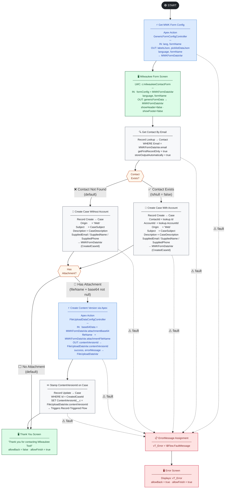
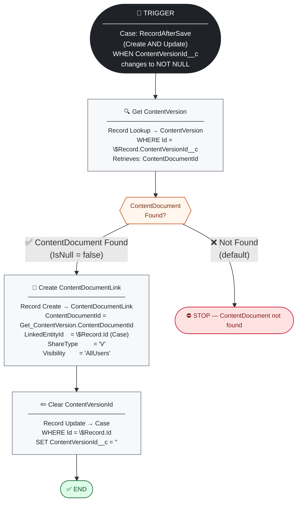
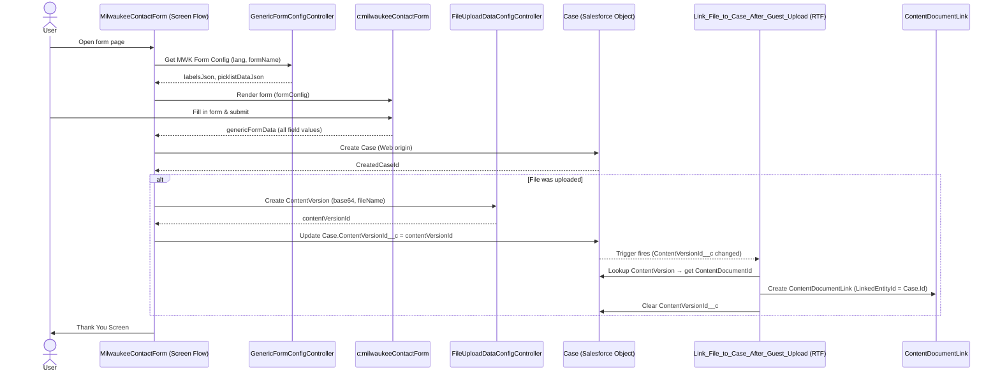

# MilwaukeeContactForm — End-to-End Flow Diagram

**Flow API Name:** `MilwaukeeContactForm`  
**LWC Component:** `c:milwaukeeContactForm`  
**Form Name Key:** `MWK_Contact`  
**Process Type:** Screen Flow  
**Run Mode:** `SystemModeWithoutSharing`  
**API Version:** 67.0  
**Status:** Draft

---

## Primary Flow — MilwaukeeContactForm

> **Note:** Unlike the Ryobi flow, `Get_MWK_Form_Config` **has** a fault connector — if the Apex action fails, execution routes to `ErrorMessage` → `Error_Screen`.

---

## Supporting Flow — Link File to Case After Guest Upload

> **Why a separate flow?** Guest users have no `ContentDocument` visibility — they cannot query or link files in the same transaction. The main Screen Flow (running in `SystemModeWithoutSharing`) stamps `ContentVersionId__c` on the Case. This Record-Triggered Flow runs in a fresh **system context** to create the `ContentDocumentLink` and then clears the staging field to prevent re-triggering.

---

## Flow Variables — MilwaukeeContactForm

| Variable | Type | Input | Default | Purpose |
|---|---|---|---|---|
| `lang` | String | ✓ | `en` | Language code (e.g. `en`, `fr`). Also written back from the LWC output. |
| `formName` | String | ✓ | `MWK_Contact` | Identifies which `FormField__mdt` records to load. |
| `MWKFormDataVar` | Apex: `GenericFormConfig` | — | — | Dual-purpose: receives `labelsJson`/`picklistDataJson` from the Apex action; then holds all user-entered values written back by the LWC on screen Next. |
| `FileUploadDataVar` | Apex: `FileUploadDataConfig` | — | — | Receives `contentVersionId`, `success`, and `errorMessage` from the file-upload Apex action. |
| `CreatedCaseId` | String | — | — | Stores the newly created Case Id for the `Stamp_ContentVersionId_on_Case` update. |
| `vT_Error` | String | — | — | Captures `$Flow.FaultMessage` from any fault connector for the Error Screen. |

---

## Text Templates — MilwaukeeContactForm

| Name | Used As | Template |
|---|---|---|
| `CaseDescription` | Case `Description` | Plain-text block with all 18 form fields: First/Last Name, Email, Phone (+country code), Culture Code, Describe Yourself, Customer Type, Enquiry About, More Details, Company Name, Job Title, Number of Employees, Trade, City, Business Postcode, Dealer Customer Number, Order Number, Model Name, Milwaukee Contact Name, Attachment filename, form submit timestamp, Message. |
| `CaseSubject` | Case `Subject` | `{enquiryAbout} - {firstName} {lastName}` |
| `SuppliedName` | Case `SuppliedName` | `{firstName} {lastName}` |

---

## Element Summary — MilwaukeeContactForm

| # | Element | Type | Connects To |
|---|---|---|---|
| 1 | `Get_MWK_Form_Config` | Apex Action (`GenericFormConfigController`) | `MilwaukeeFormScreen` |
| 2 | `MilwaukeeFormScreen` | Screen (LWC: `c:milwaukeeContactForm`) | `Get_Contact_By_Email` |
| 3 | `Get_Contact_By_Email` | Record Lookup (Contact) | `Check_Contact_Exist_or_Not` |
| 4 | `Check_Contact_Exist_or_Not` | Decision | `Create_Case_With_Account` / `Create_Case_Without_Account` |
| 5 | `Create_Case_With_Account` | Record Create (Case) | `Check_If_Attachment_Exists` |
| 6 | `Create_Case_Without_Account` | Record Create (Case) | `Check_If_Attachment_Exists` |
| 7 | `Check_If_Attachment_Exists` | Decision | `Create_Content_Version_via_Apex` / `ThankYouScreen` |
| 8 | `Create_Content_Version_via_Apex` | Apex Action (`FileUploadDataConfigController`) | `Stamp_ContentVersionId_on_Case` |
| 9 | `Stamp_ContentVersionId_on_Case` | Record Update (Case) | `ThankYouScreen` |
| 10 | `ThankYouScreen` | Screen | _(end)_ |
| 11 | `ErrorMessage` | Assignment (`vT_Error = $Flow.FaultMessage`) | `Error_Screen` |
| 12 | `Error_Screen` | Screen | _(end)_ |

---

## Element Summary — Link File to Case After Guest Upload

| # | Element | Type | Connects To |
|---|---|---|---|
| 1 | Trigger | RecordAfterSave — Case (Create/Update, `ContentVersionId__c` not null) | `Get_ContentVersion` |
| 2 | `Get_ContentVersion` | Record Lookup (ContentVersion) | `Check_ContentDocument_Found` |
| 3 | `Check_ContentDocument_Found` | Decision | `Create_ContentDocumentLink` / STOP |
| 4 | `Create_ContentDocumentLink` | Record Create (ContentDocumentLink) | `Clear_ContentVersionId` |
| 5 | `Clear_ContentVersionId` | Record Update (Case) | _(end)_ |

---

## How the Two Flows Connect

